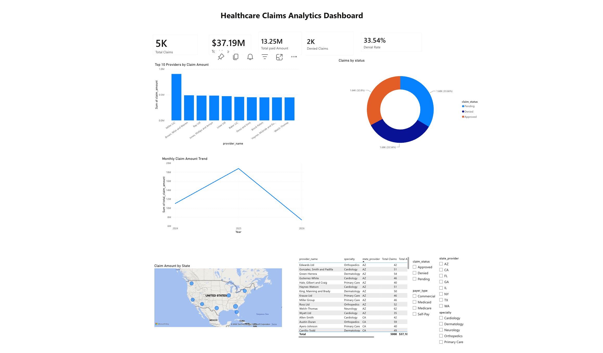
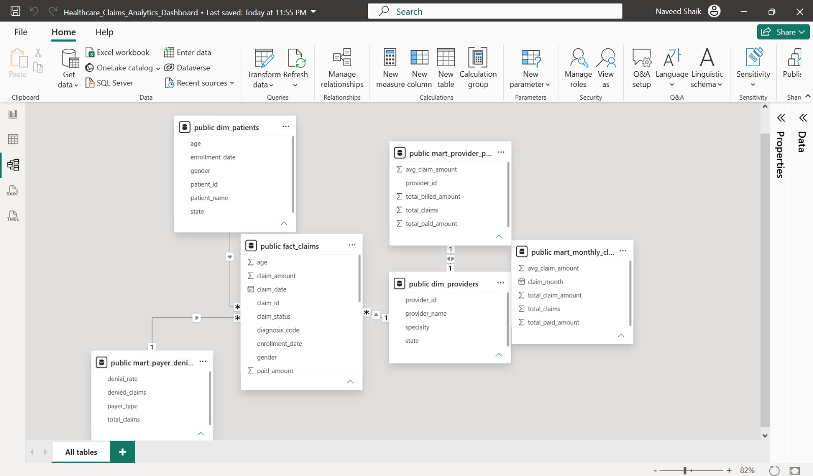
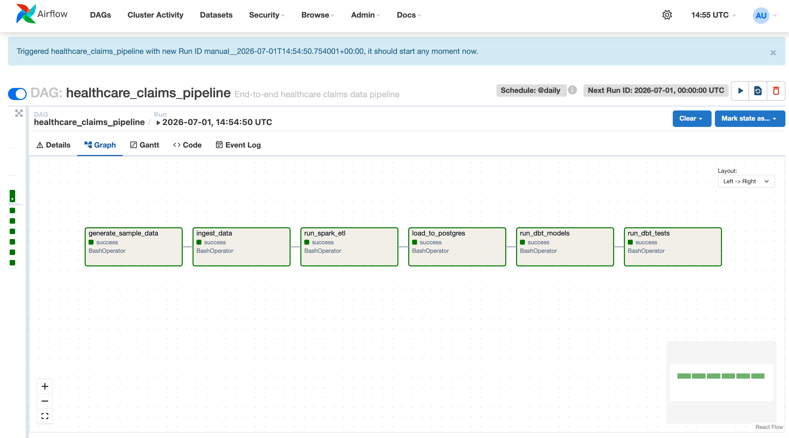
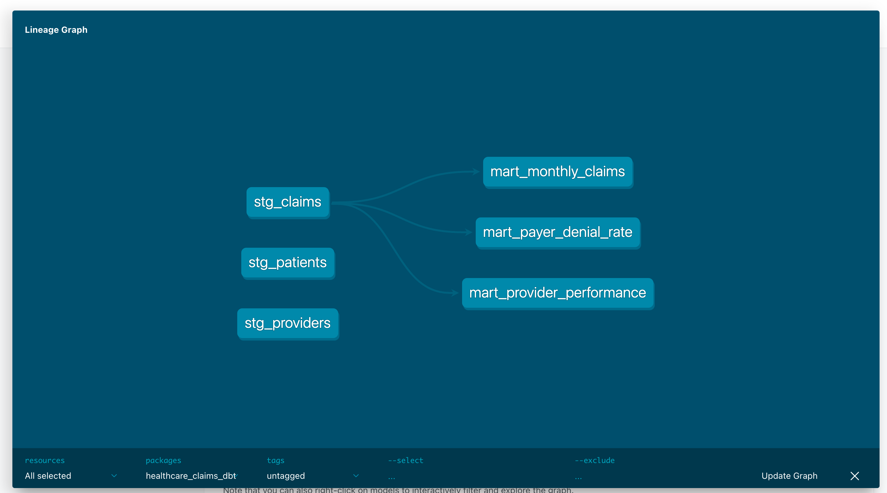

# 🏥 Healthcare Claims Analytics Pipeline

> End-to-End Data Engineering Project using **Python, PySpark, PostgreSQL, dbt, Apache Airflow, Docker, and Power BI**

## 📌 Project Overview

This project demonstrates an end-to-end healthcare data engineering pipeline that automates the ingestion, transformation, validation, storage, orchestration, and visualization of healthcare claims data.

The pipeline processes raw healthcare claims into analytics-ready datasets, enabling business users to monitor claim volumes, provider performance, payer denial rates, and financial metrics through interactive Power BI dashboards.

---

## 🎯 Business Problem

Healthcare organizations process thousands of insurance claims every day. Raw claims data often requires cleaning, transformation, and validation before it can be used for reporting and business intelligence.

This project automates that workflow by creating a scalable analytics pipeline from raw data ingestion to executive dashboards.

---

## 🏗️ Solution Architecture

```
Raw Healthcare Data
        │
        ▼
Python Data Generator
        │
        ▼
PySpark ETL
        │
        ▼
PostgreSQL Data Warehouse
        │
        ▼
dbt Data Models
        │
        ▼
Apache Airflow
        │
        ▼
Power BI Dashboard
```

---

## ⚙️ Technology Stack

| Category         | Technologies   |
| ---------------- | -------------- |
| Programming      | Python, SQL    |
| Big Data         | PySpark        |
| Database         | PostgreSQL     |
| Data Modeling    | dbt            |
| Orchestration    | Apache Airflow |
| Visualization    | Power BI, DAX  |
| Version Control  | Git, GitHub    |
| Containerization | Docker         |

---

## 📊 Live Dashboard

Explore the interactive Power BI dashboard here:

**🔗 Power BI Dashboard:**  
https://your-powerbi-link

---

# 📊 Dashboard Preview

The Power BI dashboard provides executive-level insights into healthcare claims processing, provider performance, financial metrics, and claim trends.

## Dashboard



---

## Power BI Data Model

The dashboard is built on a relational data model connecting fact and dimension tables to support efficient reporting and analytics.



---

# 🔄 Pipeline Orchestration

Apache Airflow automates the complete workflow, ensuring each stage executes in the correct sequence.

### Airflow DAG



---

# 📈 dbt Data Lineage

dbt transforms raw warehouse tables into analytics-ready models and validates data quality using automated tests.

### dbt Lineage Graph



---

# 🚀 Key Features

- End-to-end healthcare claims analytics pipeline
- Automated ETL using Python and PySpark
- PostgreSQL data warehouse with dimensional modeling
- dbt staging and mart models
- Automated data quality testing with dbt
- Apache Airflow workflow orchestration
- Interactive Power BI dashboard
- KPI monitoring for healthcare operations
- Provider performance analysis
- Claim denial rate reporting
- Monthly claims trend analysis
- Docker-based local development environment

---

# 🔄 Pipeline Workflow

1. Generate healthcare claims, patient, and provider datasets
2. Clean and transform raw data using PySpark
3. Load processed data into PostgreSQL
4. Build analytics-ready models with dbt
5. Validate data quality using dbt tests
6. Schedule and orchestrate the workflow using Apache Airflow
7. Visualize business insights in Power BI

---

# 📂 Project Structure

```
healthcare-claims-data-pipeline/
│
├── dags/                      # Apache Airflow DAGs
├── data/                      # Raw and processed datasets
├── healthcare_claims_dbt/     # dbt project
├── scripts/                   # Python ETL scripts
├── docs/
│   └── images/                # Project screenshots
├── README.md
├── docker-compose.yml
└── requirements.txt
```

---

# 🚀 How to Run the Project

### Clone the repository

```bash
git clone https://github.com/<your-username>/healthcare-claims-data-pipeline.git
```

### Install dependencies

```bash
pip install -r requirements.txt
```

### Start Docker

```bash
docker compose up -d
```

### Run Airflow

```bash
airflow standalone
```

### Run dbt

```bash
cd healthcare_claims_dbt

dbt run

dbt test
```

### Open Power BI

Connect Power BI to PostgreSQL and refresh the dashboard.

---

# 📈 Dashboard Highlights

The dashboard provides insights into:

- Total Claims Processed
- Total Claim Amount
- Total Paid Amount
- Denied Claims
- Denial Rate
- Top Providers by Claim Amount
- Monthly Claim Trends
- Provider Performance
- Claims by Status

---

# 🔮 Future Enhancements

- Real-time streaming with Apache Kafka
- Spark Structured Streaming
- Cloud deployment on AWS/Azure
- CI/CD with GitHub Actions
- Data quality monitoring
- Automated dashboard refresh
- Role-based access control

---

# 👨‍💻 Author

**Naveed Shaik**

If you found this project helpful, feel free to ⭐ the repository.
